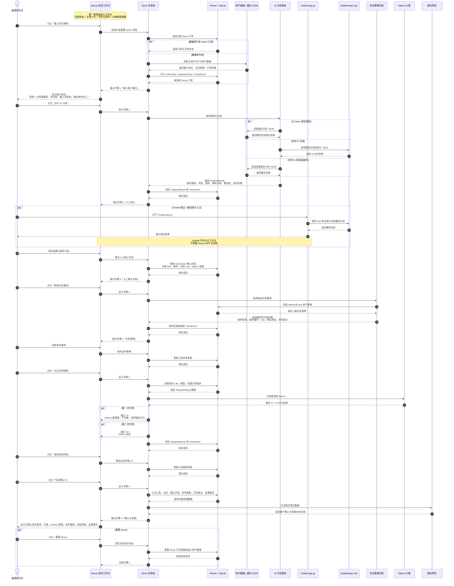

# Chainlit 智能体 Demo

基于 Chainlit 的智能体外壳，接入腾讯混元 (Hy3) 大模型。

## 🚀 快速开始

```bash
# 安装依赖
uv sync

# 启动应用
uv run poe start
```

访问 http://localhost:8000

## 📝 添加 MCP 工具

参考 `app.py` 中的注释说明，4 步即可添加工具调用功能。

## 🔧 配置

- **模型**: 腾讯混元 Hy3 (via ModelScope)
- **端口**: 8000 (Chainlit 默认)
- **热重载**: 开发模式已启用 (`-w`)

## ColorBridge MVP 时序图


